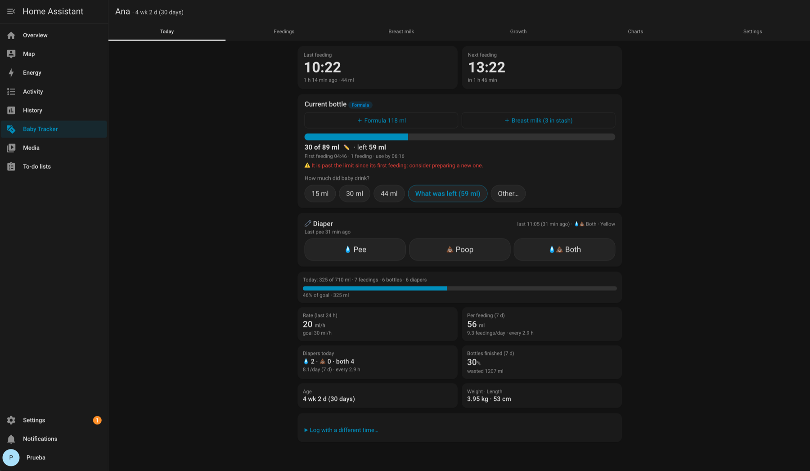
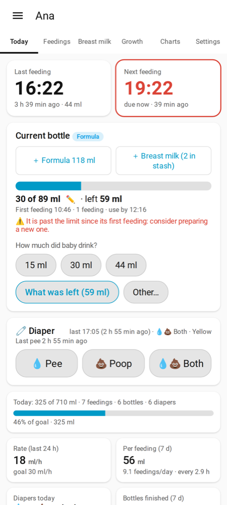
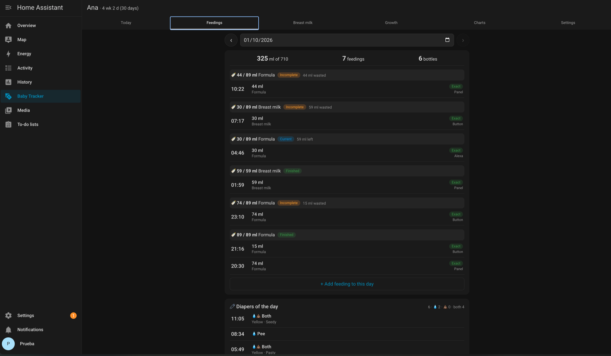
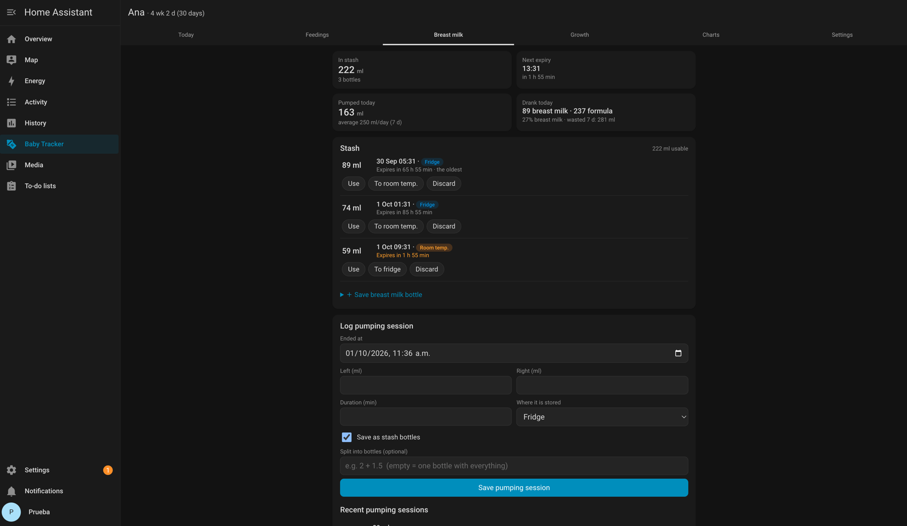
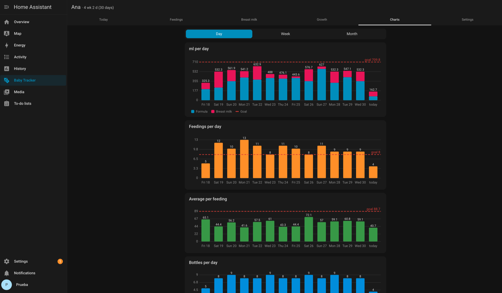
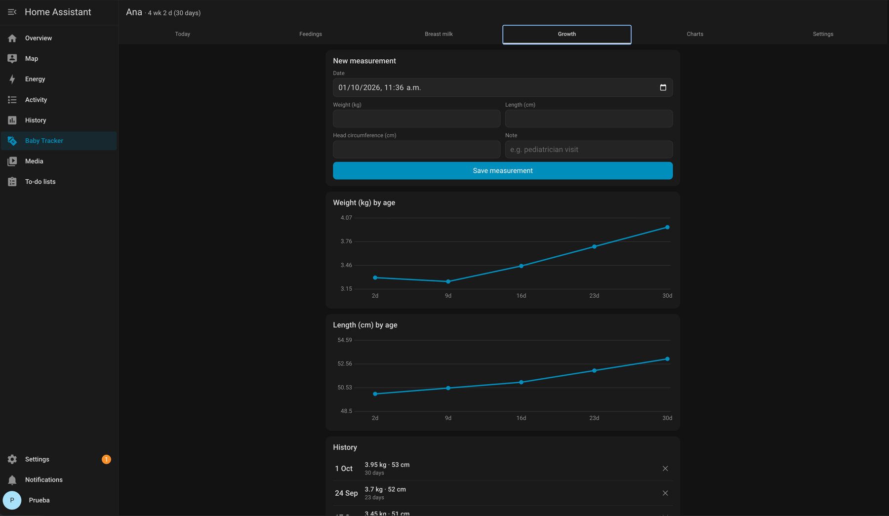
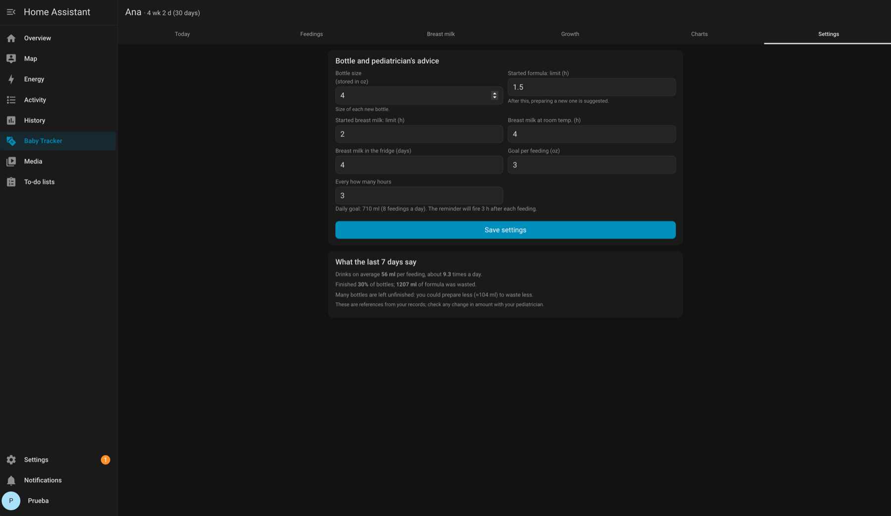

# Baby Tracker para Home Assistant

[English](README.md) · **Español**

Registra los **biberones (fórmula y leche materna), tomas, pañales, extracciones y crecimiento** de tu bebé dentro de
Home Assistant, con panel propio, gráficas, recordatorios y registro en un toque desde un botón Zigbee, tu celular o tu
asistente de voz. Todo se guarda **localmente** en tu Home Assistant (SQLite): sin nube, sin cuentas, sin suscripciones.

> ⚠️ **No es consejo médico.** Baby Tracker es una herramienta de registro. Las metas, límites y sugerencias son
> referencias generales; las decisiones sobre la alimentación y salud de tu bebé corresponden a su pediatra.

  
  

Capturas con el panel en inglés; con Home Assistant en español todo aparece en español.

## Qué hace

- **Biberones + tomas incrementales**: cada toma suma al biberón en curso; el biberón nuevo solo cuando preparas uno.
  Lo que sobrepasa va solo al siguiente. Puedes editar el tamaño del biberón en curso para casos especiales.
- **Leche materna**: extracciones (izquierdo/derecho), **reserva** (refrigerador / ambiente) con caducidad; eliges qué
  biberón de la reserva usar (primero el que caduca antes) y se descuenta; pausar la fórmula mientras das materna y continuarla después.
- **Pañales**: pipí, popó o ambos; color y consistencia de la popó con la "habitual" de tu bebé ya marcada.
- **Hoy de un vistazo**: última y siguiente toma (grandes), biberón en curso, pañales, ritmo por hora y cuánto
  *debería llevar a esta hora* contra dos metas del día: un **mínimo** y un **ideal** (la menor y la mayor entre la
  indicación del pediatra y la referencia por peso, que sigue al último peso registrado). Muestra cuánto falta por toma
  para llegar a cada una, lo esperado en las próximas tomas y qué metas se cumplieron en cada uno de los últimos 7 días.
- **Gráficas** por día, semana o mes: cantidad por día (fórmula vs materna), tomas, cantidad por toma, biberones,
  % terminados, fórmula desechada, leche extraída, pañales, y *a qué horas* come o se cambia.
- **Indicación del pediatra**: cantidad por toma e intervalo; la meta diaria y el recordatorio la siguen.
- **Crecimiento**: historial de peso, talla y perímetro cefálico.
- **Varios bebés** (¡gemelos!): una entrada por bebé y un selector en el panel.
- **oz o ml**, **español o inglés** (según el idioma de cada usuario de Home Assistant).
- **Blueprints** para botones, recordatorios, caducidad de leche, botones de notificación y voz.

## Instalación

### HACS (recomendado)
1. HACS → ⋮ → **Repositorios personalizados** → `https://github.com/HertBox/ha-baby-tracker` · tipo **Integración**.
2. Instala **Baby Tracker** y reinicia Home Assistant.
3. Configuración → Dispositivos y servicios → **Agregar integración** → **Baby Tracker**. Una entrada por bebé.

### Manual
Copia `custom_components/bebe` en tu carpeta `config/custom_components/` y reinicia.

## Configuración

Al agregar un bebé indicas **nombre, fecha de nacimiento, tamaño habitual del biberón y tipo de leche principal**.
Después, **Configurar** permite cambiar nombre, fecha, sexo, **unidad (oz/ml)** y la **popó habitual** (color y consistencia).
La pestaña **Ajustes** del panel tiene la indicación del pediatra (cantidad por toma, intervalo) y los límites de la leche.

> El dominio interno es `bebe` (entidades y acciones, p. ej. `bebe.registrar_toma`).

## El panel

| Pestaña | Para qué |
|---|---|
| **Hoy** | Última/siguiente toma, biberón en curso (*¿Cuánto tomó?*), biberón nuevo, botones de pañal, indicadores |
| **Tomas** | Día agrupado por biberón; editar, borrar, mover tomas; pañales del día |
| **Materna** | Reserva con caducidad, guardar leche, extracciones |
| **Medidas** | Peso / talla / perímetro y sus gráficas |
| **Gráficas** | Día / semana / mes |
| **Ajustes** | Tamaño del biberón, indicación del pediatra, límites de la leche, sugerencias de los últimos 7 días |

| Tomas | Leche materna |
|---|---|
|  |  |
| **Gráficas** | **Desarrollo** |
|  |  |

Ajustes

## Blueprints

| Blueprint | Qué hace | |
|---|---|---|
| **Botón: cada toque suma al biberón** | Cada toque suma p. ej. 0.5 oz; toques seguidos = una toma; un solo resumen |  |
| **Botón: mantener = biberón nuevo** | Presión larga → biberón nuevo del tamaño habitual |  |
| **Recordatorio de toma** | Si llega la hora y no hay registro, pregunta en tus celulares; respondes con cantidad y/o la hora real |  |
| **Leche materna por caducar** | Avisa antes de que caduque la reserva: Usar / Al refri / Desechar |  |
| **Botones de las notificaciones** | **Necesario** para los demás: Deshacer, Corregir, Era biberón nuevo, respuestas, reserva |  |
| **Voz con lista + IA** *(opcional)* | Para asistentes que agregan a una lista (p. ej. listas de Alexa): una entidad AI Task interpreta "tomó una onza" |  |

Las respuestas del recordatorio aceptan `1.5`, `20:15 1.5`, `hace 40 min`, `nuevo 2` (y en inglés `40 min ago`, `new 2`).
Las cantidades van en la unidad del bebé.

## Acciones

Todas aceptan el campo opcional `bebe` (id de la entrada o nombre), obligatorio solo si hay más de un bebé.
Ver la tabla completa en el [README en inglés](README.md#actions-services). Cada respuesta incluye `bebe`, `nombre` y `unidad`.

## Datos y respaldos

Los datos de cada bebé están en `config/bebe.db` (bebés adicionales: `config/bebe_<id>.db`) y entran en los respaldos
de Home Assistant. Antes de actualizar la base se guarda una copia `<archivo>.antes-vN`. Al quitar un bebé su archivo se conserva.

## Limitaciones

- Gráficas sencillas en SVG; los percentiles de crecimiento (curvas OMS) están planeados.
- La leche materna registrada por voz (o con una acción sin `reserva_id`) no se toma de la reserva; para eso usa el panel.
- La API REST muestra los errores de validación como HTTP 500 (comportamiento de Home Assistant); el panel y las automatizaciones muestran el mensaje correcto.

## Licencia

[MIT](LICENSE)
